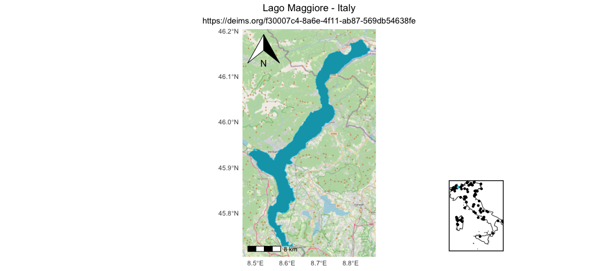

# Provide a map object of a sites LTER.

**\[stable\]** This function produces a `map` of the site boundaries as
provided by the [DEIMS-SDR catalogue](https://deims.org/), within a
given country and network.

## Usage

``` r
produce_site_map(
  deimsid,
  scale_location = "bl",
  arrow_location = "tl",
  inset_position = "br"
)
```

## Arguments

- deimsid:

  A `character`. The DEIMS ID of network from DEIMS-SDR website. DEIMS
  ID information [here](https://deims.org/docs/deimsid.html).

- scale_location:

  A `character`. Position of the map scale (e.g. "bl", "br"). Options:
  `"tl"` = top-left, `"tr"` = top-right, `"bl"` = bottom-left, `"br"` =
  bottom-right. Default is `"bl"`.

- arrow_location:

  A `character`. Position of the north arrow (e.g. "tl", "tr"). Options:
  `"tl"` = top-left, `"tr"` = top-right, `"bl"` = bottom-left, `"br"` =
  bottom-right. Default is `"tl"`.

- inset_position:

  A `character`. Position of the country overview inset map. Options:
  `"tl"` = top-left, `"tr"` = top-right, `"bl"` = bottom-left, `"br"` =
  bottom-right. Default is `"br"`.

## Value

The output of the function is an `image` of the boundary of the site,
OSM as base map and all country sites map.

## The function output



## See also

[`ggspatial::annotation_map_tile()`](https://paleolimbot.github.io/ggspatial/reference/annotation_map_tile.html)

[`ggspatial::annotation_scale()`](https://paleolimbot.github.io/ggspatial/reference/annotation_scale.html)

[`ggspatial::annotation_north_arrow()`](https://paleolimbot.github.io/ggspatial/reference/annotation_north_arrow.html)

[`cowplot::ggdraw()`](https://wilkelab.org/cowplot/reference/ggdraw.html)

[`cowplot::draw_plot()`](https://wilkelab.org/cowplot/reference/draw_plot.html)

[`geodata::gadm()`](https://rspatial.github.io/geodata/reference/gadm.html)

## Author

Alessandro Oggioni, phD (2020) <oggioni.a@irea.cnr.it>

## Examples

``` r
if (FALSE) { # \dontrun{
# Example of Lange Bramke site
siteMap <- produce_site_map(
  deimsid = "https://deims.org/8e24d4f8-d6f6-4463-83e9-73cac2fd3f38"
)

# Example of Eisenwurzen site
siteMap <- produce_site_map(
  deimsid = "https://deims.org/d0a8da18-0881-4ebe-bccf-bc4cb4e25701",
  inset_position = "bl"
)

# Example of Lake Maggiore site
siteMap <- produce_site_map(
  deimsid = "https://deims.org/f30007c4-8a6e-4f11-ab87-569db54638fe",
  scale_location = "bl",
  arrow_location = "tl",
  inset_position = "br"
)
} # }
```
