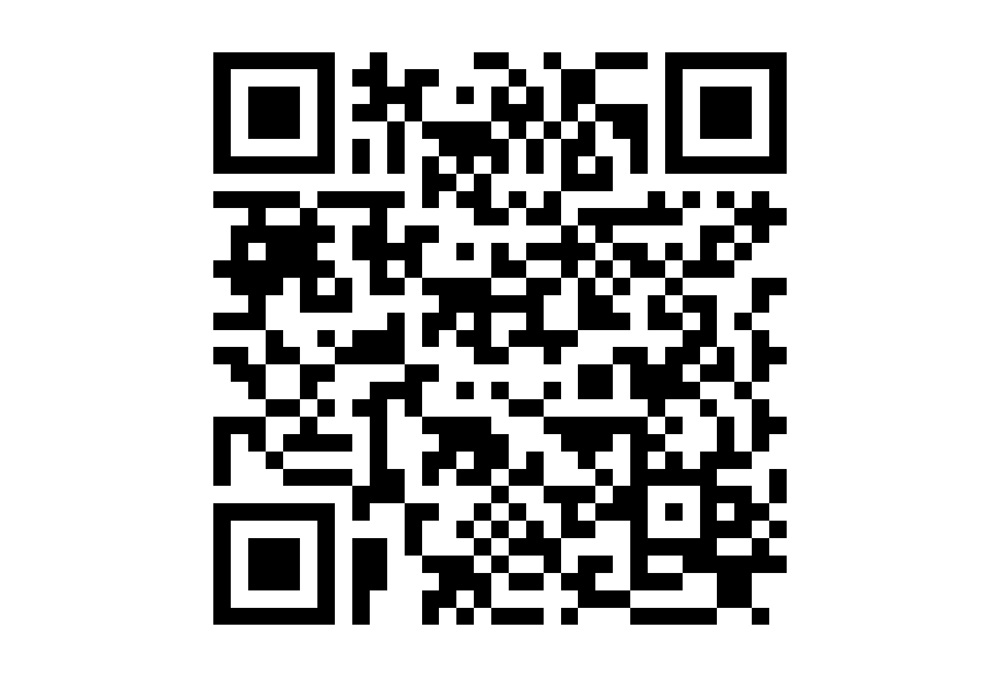

# Obtain the QRCode of any DEIMS-SDR entities.

**\[stable\]** Return a QR code image of any provided DEIMS ID (e.g.
dataset, site, activity).

## Usage

``` r
produce_site_qrcode(deimsid, do_plot = FALSE)
```

## Arguments

- deimsid:

  A `character`. The DEIMS ID of entities from DEIMS-SDR website. DEIMS
  ID information [here](https://deims.org/docs/deimsid.html).

- do_plot:

  A `boolean`. Plot the computed QRCode. Default FALSE.

## Value

The QR code as a logical matrix with "qr_code" class.

## The function output



## Author

Alessandro Oggioni, phD (2020) <oggioni.a@irea.cnr.it>

## Examples

``` r
qrcode <- produce_site_qrcode(
  deimsid = "https://deims.org/f30007c4-8a6e-4f11-ab87-569db54638fe"
)

a <- produce_site_qrcode(
  deimsid = "https://deims.org/f30007c4-8a6e-4f11-ab87-569db54638fe",
  do_plot = TRUE
)

```
